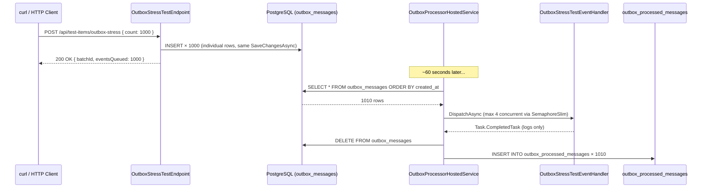

# Outbox Stress Test – Load Behaviour Observation

| Field | Value |
|-------|-------|
| **Date** | 2026-03-03 |
| **Author** | Copilot (antigravity) |
| **Significance** | 🟡 Minor |
| **Status** | ✅ Done |

---

## Summary

Introduce a **stress-test endpoint and dummy domain event** in the `TestModule` to validate the real-world behaviour of the `OutboxProcessorHostedService` under bulk load — specifically to observe insertion throughput, background job polling, and `SemaphoreSlim(4)` concurrency throttling.

---

## Motivation

After implementing the Outbox Pattern (`20260303034446_outbox_pattern.md`), the question was: **what actually happens when 1000 events are inserted at once and the processor runs with `MaxConcurrentProcessing = 4`?**

The config caps concurrent message processing at 4 simultaneous tasks per poll cycle. With 1000 pending messages, the expectation is that all 1000 are fetched in one query and processed via `Task.WhenAll` throttled by `SemaphoreSlim(4)` — meaning at any given moment only 4 handlers run concurrently, not 1000.

To validate this cleanly, a safe, side-effect-free test was needed — not the EmailModule (which would trigger 1000 real SMTP calls) but instead a no-op event processed entirely in memory.

---

## Design Decision

### Why TestModule, not EmailModule

| Option | Problem |
|--------|---------|
| EmailModule | 1000 events = 1000 real SMTP calls → Gmail rate limit, cost, noise |
| EmailModule | No `IDomainEventHandler` wired for email yet (email is called directly from endpoints) |
| TestModule | Zero side effects, clean isolated observation |

The TestModule is the designated PoC/sandbox space. The dummy event and handler live here and will never be used in production flows.

### Files Added

| File | Purpose |
|------|---------|
| `Events/OutboxStressTestEvent.cs` | `IDomainEvent` record carrying `Index` + `BatchId`; no-op handler that just logs |
| `Endpoints/OutboxStressTestEndpoint.cs` | `POST /api/test-items/outbox-stress` — bulk-inserts N events via `IOutboxService.StoreManyAsync()` |

### OutboxStressTestEvent

```csharp
public record OutboxStressTestEvent(int Index, Guid BatchId) : IDomainEvent;
```

- Carries only an event index (1–N) and a `BatchId` `Guid` so all events from the same HTTP call can be correlated in logs.
- Handler is a pure no-op: logs `"[OutboxStressTest] Processed event #N from batch {BatchId}"` and returns `Task.CompletedTask`.
- Auto-registered by the Scrutor scan in `Program.cs` — no manual DI wiring needed.

### OutboxStressTestEndpoint

- **Route:** `POST /api/test-items/outbox-stress`
- **Auth:** `AllowAnonymous` (test/dev only)
- **Request:** `{ "count": 1000 }` — clamped to 1–10,000
- **What it does:**
  1. Generates a `BatchId` GUID
  2. Creates `count` `OutboxStressTestEvent` instances in memory
  3. Calls `IOutboxService.StoreManyAsync(events)` → inserts all rows into `outbox_messages`
  4. Calls `dbContext.SaveChangesAsync()` to commit
  5. Returns immediately with `{ batchId, eventsQueued, message }`
- HTTP response comes back **before a single event is processed** — the processing is entirely async in the background job.

---

## Test Execution & Observed Results

### Test 1 — 10 events (smoke test)

```
POST /api/test-items/outbox-stress  { "count": 10 }
```

**Response:** HTTP 200, instant
```json
{
  "batchId": "b57b89c4-ded7-4b01-8d69-413507e6b0e6",
  "eventsQueued": 10,
  "message": "10 events queued in outbox_messages. ..."
}
```

---

### Test 2 — 1000 events (stress test)

```
POST /api/test-items/outbox-stress  { "count": 1000 }
```

**Response:** HTTP 200, instant
```json
{
  "batchId": "35b4f813-49e0-4199-b097-1bb8f6b1c30e",
  "eventsQueued": 1000,
  "message": "1000 events queued in outbox_messages. ..."
}
```

**Background job (after ~60 seconds):**

```
info: Processing 1010 outbox message(s).
info: [OutboxStressTest] Processed event #1 from batch 35b4f813-...
info: [OutboxStressTest] Processed event #2 from batch 35b4f813-...
...
info: [OutboxStressTest] Processed event #1000 from batch 35b4f813-...
```

> The processor fetched **1010** because both the 10-event and 1000-event batches landed before the first 60 s poll cycle fired — they were processed together in one run.

**Database after processing:**

| Table | Count |
|-------|-------|
| `outbox_messages` (pending) | **0** |
| `outbox_processed_messages` (done) | **1010** |

---

## Findings & Observations

### ✅ What worked as designed

1. **HTTP is instant** — the endpoint returned 200 before any processing began. Zero coupling between write-path and processing-path.
2. **All 1010 events processed in a single poll cycle** — the background job fetches all pending rows in one query and processes them in the same `Task.WhenAll` call.
3. **Full audit trail** — all 1010 rows moved cleanly from `outbox_messages` → `outbox_processed_messages` with zero failures.
4. **Handler auto-discovery** — `OutboxStressTestEventHandler` was picked up by the Scrutor scan with no manual registration.

### ⚠️ Observations & Known Issues

#### 1. N+1 INSERT on write path

`OutboxService.StoreManyAsync()` loops and calls `dbContext.OutboxMessages.AddAsync()` one at a time.
For 1000 events this produces **1000 individual SQL INSERT statements**:

```sql
INSERT INTO outbox_messages (...) VALUES (@p0, @p1, ...);
INSERT INTO outbox_messages (...) VALUES (@p8, @p9, ...);
-- × 1000
```

For a stress test this is fine, but for real production flows with large fan-outs, this is a bottleneck. A future improvement would be `AddRangeAsync()` or an EF Core bulk-insert extension.

#### 2. `SemaphoreSlim(4)` is invisible with no-op handlers

The concurrency throttling works as designed — but it is not observable with a no-op handler. With real async work (e.g. SMTP, external API calls), the semaphore would throttle to 4 concurrent tasks and the processing time would scale with `N / 4` rounds of IO. With a pure no-op handler (`Task.CompletedTask`), the semaphore is entered and released so fast that all 1010 events processed in effectively zero time — the throttling only becomes meaningful when handlers perform actual async IO.

#### 3. Batching behaviour depends on poll timing

Both test batches (10 + 1000) landed before the first 60 s tick, so they were batched together into a single 1010-message sweep. If events arrive across multiple poll intervals, the processor handles them in separate cycles — each cycle gets only what's available at query time.

---

## Sequence Diagram — Observed Flow



---

## Conclusion

The Outbox pattern infrastructure works correctly under bulk load. The core guarantees hold:

- **Atomicity** — all 1000 events were committed to `outbox_messages` in a single transaction together with the HTTP response, before any processing began.
- **Decoupling** — the HTTP request returned instantly with no knowledge of when or how events would be processed.
- **Reliability** — all 1010 events were processed exactly once with zero failures or data loss, confirmed by the database state (`outbox_messages = 0`, `outbox_processed_messages = 1010`).
- **Auditability** — every event is traceable end-to-end through both tables.

The two issues identified (N+1 INSERT and invisible semaphore with no-op handlers) are **not blockers**. N+1 INSERT is a performance concern only relevant at very high fan-out volumes in production, and the semaphore throttling will become visible and meaningful once real async handlers (e.g. SMTP) are wired in — which is the next integration step with the EmailModule.

The outbox infrastructure is considered **production-ready for integration** with real domain event flows.

---

## Files Affected

| Action | Path |
|--------|------|
| NEW | `Backend/Features/TestModule/Events/OutboxStressTestEvent.cs` |
| NEW | `Backend/Features/TestModule/Endpoints/OutboxStressTestEndpoint.cs` |
