# Domain Event Storming

| Field | Value |
|-------|-------|
| **Date** | 2026-02-23 |
| **Author** | Copilot (antigravity) |
| **Significance** | 🔴 Major |
| **Status** | ✅ Approved |

---

## Summary

Full event storming of all domain events in **SIGMA (SBMLiterationApp)**. This maps every command that a user or admin can issue, the domain event it produces, and the downstream side effects handled by event handlers across all modules. This is the authoritative reference for the event-driven behaviour of the system.

---

## Motivation

The system uses a custom domain event dispatcher pattern where multiple handlers can react to a single event across module boundaries. Without a formal event storming diagram, it is difficult to trace the full consequence of any given user action — especially for the XP and streak side effects which chain across 3 modules.

---

## Design Decision

Domain events are raised inside aggregate factory methods (`.Create()`) using the `.Raise()` method inherited from `AuditableEntity`. They are dispatched synchronously inside `UnitOfWork.SaveChangesAsync()` via `DomainEventsDispatcher`. Handlers are registered as scoped services.

**Key event chains:**

1. **Submit Reading Report** → `ReadingReportCreatedEvent` → *(a)* `ReadingExpEventHandler` awards page-based XP → `UserExpCreatedEvent` → `UserExpSnapshotEventHandler` optionally snapshots; *(b)* `StreakLogFromReadingReportEventHandler` creates a streak log → `StreakLogCreatedEvent` → `StreakExpEventHandler` optionally awards 7-day streak bonus XP

2. **Answer Quiz** → `QuizAnsweredEvent` → *(a)* `DailyReadsExpEventHandler` awards 10 XP if passing score → `UserExpCreatedEvent` → `UserExpSnapshotEventHandler`; *(b)* `StreakLogFromQuizAnswerEventHandler` creates a streak log → `StreakLogCreatedEvent` → `StreakExpEventHandler`

3. **Create Book** → `ReadingBookCreatedEvent` (no downstream handlers currently — placeholder for future book-tracking features)

4. **Create Reading Recommendation** → `ReadingRecommendationCreatedEvent` (no downstream handlers currently)

---

## Event Storming Diagram

```mermaid
flowchart TD
    %% ─────────────────────────────────────────────
    %% STYLE LEGEND
    %% Orange = Command, Blue = Domain Event,
    %% Green = Handler/Policy, Purple = Side Effect / Read Model
    %% ─────────────────────────────────────────────

    subgraph AUTH ["🔐 Auth Module"]
        CMD_GOOGLE["👤 User clicks Sign in with Google"]
        CMD_CALLBACK["📬 OAuth Callback received (code + state)"]
        EVT_USER_CREATED["📘 User Created\n(first-time Google login)"]
        CMD_REFRESH["🔄 Token Refresh requested"]

        CMD_GOOGLE --> CMD_CALLBACK
        CMD_CALLBACK --> EVT_USER_CREATED
        EVT_USER_CREATED --> SE_ONBOARDING["➡️ Redirect to /onboarding\n(NIM/Profile incomplete)"]
        CMD_CALLBACK --> SE_JWT["🔑 JWT Access Token + Refresh Token issued"]
        CMD_REFRESH --> SE_JWT
    end

    subgraph READING_RESOURCE ["📚 Reading Resource Module"]
        CMD_CREATE_BOOK["👤 Participant creates Book"]
        CMD_CREATE_JOURNAL["👤 Participant creates Journal Paper"]
        CMD_DELETE_RESOURCE["👤 Participant deletes Resource"]

        CMD_CREATE_BOOK --> EVT_BOOK_CREATED["📘 ReadingBookCreatedEvent"]
        CMD_CREATE_JOURNAL --> EVT_JOURNAL_CREATED["📘 JournalPaperCreatedEvent\n(implicit — no handlers yet)"]
        CMD_DELETE_RESOURCE --> GUARD_CAN_DELETE{"Has ReadingReports?"}
        GUARD_CAN_DELETE -- "No" --> SE_DELETED["✅ Resource deleted"]
        GUARD_CAN_DELETE -- "Yes" --> SE_DELETE_BLOCKED["❌ 400 DeleteFailed"]

        EVT_BOOK_CREATED --> NOTE_BOOK["ℹ️ No downstream handlers\n(placeholder for future)"]
    end

    subgraph READING_REPORT ["📝 Reading Report Module"]
        CMD_SUBMIT_REPORT["👤 Participant submits Reading Report\n(currentPage, insight, timeSpent)"]
        EVT_REPORT_CREATED["📘 ReadingReportCreatedEvent\n(report, lastPage)"]
        EVT_BOOK_COMPLETED["📘 BookCompletedEvent\n(raised simultaneously)"]

        CMD_SUBMIT_REPORT --> EVT_REPORT_CREATED
        CMD_SUBMIT_REPORT --> EVT_BOOK_COMPLETED
    end

    subgraph STREAK ["🔥 Streak Module"]
        HANDLER_STREAK_FROM_REPORT["🟢 StreakLogFromReadingReportEventHandler\nlisten: ReadingReportCreatedEvent"]
        HANDLER_STREAK_FROM_QUIZ["🟢 StreakLogFromQuizAnswerEventHandler\nlisten: QuizAnsweredEvent"]
        EVT_STREAK_CREATED["📘 StreakLogCreatedEvent"]

        EVT_REPORT_CREATED --> HANDLER_STREAK_FROM_REPORT
        HANDLER_STREAK_FROM_REPORT --> GUARD_STREAK_TODAY{"StreakLog for today\nalready exists?"}
        GUARD_STREAK_TODAY -- "No" --> EVT_STREAK_CREATED
        GUARD_STREAK_TODAY -- "Yes" --> SE_STREAK_SKIP["⏭️ Skip — idempotent"]

        HANDLER_STREAK_FROM_QUIZ --> GUARD_QUIZ_PASS{"correctCount >=\nminimalCorrectAnswer?"}
        GUARD_QUIZ_PASS -- "No" --> SE_QUIZ_NO_STREAK["⏭️ No streak awarded"]
        GUARD_QUIZ_PASS -- "Yes" --> GUARD_STREAK_TODAY2{"StreakLog for today\nalready exists?"}
        GUARD_STREAK_TODAY2 -- "No" --> EVT_STREAK_CREATED
        GUARD_STREAK_TODAY2 -- "Yes" --> SE_STREAK_SKIP2["⏭️ Skip — idempotent"]
    end

    subgraph XP ["⭐ XP Module"]
        HANDLER_READING_EXP["🟢 ReadingExpEventHandler\nlisten: ReadingReportCreatedEvent"]
        HANDLER_DAILY_EXP["🟢 DailyReadsExpEventHandler\nlisten: QuizAnsweredEvent"]
        HANDLER_STREAK_EXP["🟢 StreakExpEventHandler\nlisten: StreakLogCreatedEvent"]
        HANDLER_BOOK_EXP["🟢 BookCompletedExpEventHandler\nlisten: BookCompletedEvent"]
        EVT_EXP_CREATED["📘 UserExpCreatedEvent"]
        HANDLER_SNAPSHOT["🟢 UserExpSnapshotEventHandler\nlisten: UserExpCreatedEvent"]

        EVT_REPORT_CREATED --> HANDLER_READING_EXP
        HANDLER_READING_EXP --> CALC_READING_EXP["🔢 exp = (currentPage - lastPage)\n× READING_PER_PAGE (0.1)"]
        CALC_READING_EXP --> EVT_EXP_CREATED

        EVT_STREAK_CREATED --> HANDLER_STREAK_EXP
        HANDLER_STREAK_EXP --> GUARD_7DAY{"consecutiveStreak\n% 7 == 0?"}
        GUARD_7DAY -- "No" --> SE_NO_BONUS["⏭️ No streak bonus"]
        GUARD_7DAY -- "Yes" --> GUARD_ALREADY_GIVEN{"XP already given\nfor this streakLog.Id?"}
        GUARD_ALREADY_GIVEN -- "Yes" --> SE_SKIP_BONUS["⏭️ Skip — idempotent"]
        GUARD_ALREADY_GIVEN -- "No" --> CALC_STREAK_EXP["🔢 exp = STREAK_7_DAYS_BONUS (2)"]
        CALC_STREAK_EXP --> EVT_EXP_CREATED

        HANDLER_DAILY_EXP --> GUARD_QUIZ_PASS2{"correctCount >=\nminimalCorrectAnswer?"}
        GUARD_QUIZ_PASS2 -- "No" --> SE_NO_DAILY_EXP["⏭️ No XP awarded"]
        GUARD_QUIZ_PASS2 -- "Yes" --> GUARD_DAILY_EXP_GIVEN{"XP already given\nfor this DailyRead+User?"}
        GUARD_DAILY_EXP_GIVEN -- "Yes" --> SE_SKIP_DAILY_EXP["⏭️ Skip — idempotent"]
        GUARD_DAILY_EXP_GIVEN -- "No" --> CALC_DAILY_EXP["🔢 exp = DAILY_READ_QUIZ_PASSED (10)"]
        CALC_DAILY_EXP --> EVT_EXP_CREATED

        EVT_BOOK_COMPLETED --> HANDLER_BOOK_EXP
        HANDLER_BOOK_EXP --> GUARD_BOOK_COOLDOWN{"Book completed within\nlast 7 days?"}
        GUARD_BOOK_COOLDOWN -- "Yes" --> SE_SKIP_BOOK_EXP["⏭️ Skip — cooldown"]
        GUARD_BOOK_COOLDOWN -- "No" --> CALC_BOOK_EXP["🔢 exp = BOOK_COMPLETED (3)\nor recommended variant"]
        CALC_BOOK_EXP --> EVT_EXP_CREATED

        EVT_EXP_CREATED --> HANDLER_SNAPSHOT
        HANDLER_SNAPSHOT --> GUARD_SNAPSHOT{"unsnapshotted events\n>= SNAPSHOT_INTERVAL (7)?"}
        GUARD_SNAPSHOT -- "No" --> SE_NO_SNAPSHOT["⏭️ No snapshot yet"]
        GUARD_SNAPSHOT -- "Yes" --> SE_SNAPSHOT["💾 UserExpSnapshot created\n(sum of delta events)"]
    end

    subgraph DAILY_READS ["📅 Daily Reads Module"]
        CMD_ANSWER_QUIZ["👤 Participant answers quiz question"]
        EVT_QUIZ_ANSWERED["📘 QuizAnsweredEvent"]

        CMD_ANSWER_QUIZ --> EVT_QUIZ_ANSWERED
        EVT_QUIZ_ANSWERED --> HANDLER_STREAK_FROM_QUIZ
        EVT_QUIZ_ANSWERED --> HANDLER_DAILY_EXP
    end

    subgraph READ_MODELS ["📊 Read Models / Projections"]
        RM_LEADERBOARD["🗂️ user_exp_leaderboard VIEW\n(PostgreSQL)\nSnapshot + Delta = TotalExp"]
        RM_STREAK_WIDGET["🗂️ Streak Widget\nCurrentStreakDays + WeeklyStatus"]
        RM_ACTIVITY_FEED["🗂️ Activity Feed\nUserExpEvents → natural language"]

        EVT_EXP_CREATED -.->|"materialised by"| RM_LEADERBOARD
        EVT_STREAK_CREATED -.->|"drives"| RM_STREAK_WIDGET
        EVT_EXP_CREATED -.->|"drives"| RM_ACTIVITY_FEED
    end
```

---

## Event Summary Table

| Domain Event | Raised By | Handled By | Side Effect |
|-------------|-----------|-----------|-------------|
| `ReadingReportCreatedEvent` | `ReadingReport.Create()` | `ReadingExpEventHandler` | Creates `UserExpEvent` (page × 0.1 XP) |
| `ReadingReportCreatedEvent` | `ReadingReport.Create()` | `StreakLogFromReadingReportEventHandler` | Creates `StreakLog` for today (idempotent) |
| `BookCompletedEvent` | `ReadingReport.Create()` | `BookCompletedExpEventHandler` | Creates `UserExpEvent` (3 XP, 7-day cooldown) |
| `StreakLogCreatedEvent` | `StreakLog.Create()` | `StreakExpEventHandler` | Creates `UserExpEvent` (2 XP) if streak % 7 == 0 |
| `QuizAnsweredEvent` | Quiz answer endpoint | `DailyReadsExpEventHandler` | Creates `UserExpEvent` (10 XP) if passing score (idempotent) |
| `QuizAnsweredEvent` | Quiz answer endpoint | `StreakLogFromQuizAnswerEventHandler` | Creates `StreakLog` for today if passing score (idempotent) |
| `UserExpCreatedEvent` | `UserExpEvent.Create()` | `UserExpSnapshotEventHandler` | Creates `UserExpSnapshot` every 7 unsnapshotted events |
| `ReadingBookCreatedEvent` | `Book.Create()` | *(none currently)* | Placeholder — no downstream handlers |
| `ReadingRecommendationCreatedEvent` | `ReadingRecommendation.Create()` | *(none currently)* | Placeholder — no downstream handlers |

---

## Files Affected

| File | Notes |
|------|-------|
| `Backend/Features/ReadingResourceModule/Domain/Entities/ReadingReport.cs` | Raises `ReadingReportCreatedEvent` + `BookCompletedEvent` |
| `Backend/Features/ReadingResourceModule/Domain/Book.cs` | Raises `ReadingBookCreatedEvent` |
| `Backend/Features/StreakModule/Domain/StreakLog.cs` | Raises `StreakLogCreatedEvent` |
| `Backend/Features/UserXpModule/Domain/UserExpEvent.cs` | Raises `UserExpCreatedEvent` |
| `Backend/Features/UserXpModule/Domain/Events/ReadingExpEventHandler.cs` | Handles `ReadingReportCreatedEvent` |
| `Backend/Features/UserXpModule/Domain/Events/DailyReadsExpEventHandler.cs` | Handles `QuizAnsweredEvent` |
| `Backend/Features/UserXpModule/Domain/Events/StreakExpEventHandler.cs` | Handles `StreakLogCreatedEvent` |
| `Backend/Features/UserXpModule/Domain/Events/UserExpSnapshotEventHandler.cs` | Handles `UserExpCreatedEvent` |
| `Backend/Features/StreakModule/Domain/Events/StreakLogFromReadingReportEventHandler.cs` | Handles `ReadingReportCreatedEvent` |
| `Backend/Features/StreakModule/Domain/Events/StreakLogFromQuizAnswerEventHandler.cs` | Handles `QuizAnsweredEvent` |
| `Backend/Core/Events/DomainEventsDispatcher.cs` | Dispatches all domain events in `UnitOfWork.SaveChangesAsync()` |

---

## Risks & Mitigations

| Risk | Mitigation |
|------|-----------|
| Two events raised in the same `ReadingReport.Create()` — handler execution order is implicit | Both handlers are idempotent and independent; explicit ordering to be addressed if race conditions emerge |
| `StreakExpEventHandler` queries all streak logs for a user on every streak creation — O(n) reads | Acceptable at current scale; can be optimised with a materialized consecutive-streak counter in a future log |
| `DailyReadsExpEventHandler` and `StreakLogFromQuizAnswerEventHandler` both react to `QuizAnsweredEvent` and both need to evaluate the quiz result independently | Duplication of quiz evaluation logic; consider a `QuizPassedEvent` as a higher-level event in a future refactor |
| `UserExpSnapshotEventHandler` calls `SaveChangesAsync()` inside a handler that is already inside a `UnitOfWork` transaction | Snapshot is saved in a separate `SaveChangesAsync()` call — this is intentional but must not be changed without careful review |