# Group & Assignment Module

| Field | Value |
|-------|-------|
| **Date** | 2026-02-23 |
| **Author** | Copilot (antigravity) |
| **Significance** | 🔴 Major |
| **Status** | ✅ APPROVED |

---

## Summary

Introduce two new feature modules to SIGMA:

1. **GroupModule** — Admins manage **Groups** and their **members via Excel upload only**. Two upload variants exist: upload with group name embedded in the sheet (creates groups on the fly), and upload scoped to an existing group (group ID in the route). A user belongs to **exactly one group**.
2. **AssignmentModule** — Admins create **Assignments** broadcast to all groups. Participants attach files (MinIO) or external links to their group's submission. Completion is a separate "mark as complete" toggle on the group submission.

No XP or streak hooks. No domain events. This is CRUD + Excel import.

---

## Motivation

The admin does not manually type out student names one by one — they have an existing Excel roster. The two upload variants cover the two real-world scenarios:

- **Scenario A:** Admin has a single master roster Excel with a column for group name → one upload creates all groups and assigns all members.
- **Scenario B:** Admin has separate per-group Excel files with only student NIMs/names → upload is scoped to an existing group via the route.

All other member management (add one, remove one, update one) is intentionally **not exposed** — the Excel upload is the only write path for group membership.

---

## Design Decision

### Group CRUD
- `POST /api/groups` — create group (**name only**)
- `PUT /api/groups/{id}` — update group (**name only**, nothing else)
- `DELETE /api/groups/{id}` — delete group (guard: no submissions with files or completed)
- `GET /api/groups` — list all groups (paginated)
- `GET /api/groups/{id}` — group detail + members

### Group Member Management — Excel Upload Only
Two upload endpoints, no individual add/remove/update:

| Endpoint | Excel columns expected | Behaviour |
|----------|----------------------|-----------|
| `POST /api/groups/members/upload` | `GroupName`, `NIM` | Creates groups by name if not exists, then assigns users by NIM. **Full replace per group**: all existing members of affected groups are removed before re-importing. |
| `POST /api/groups/{id}/members/upload` | `NIM` only | Assigns users by NIM to the specified group. **Full replace**: all existing members of this group are removed before re-importing. |

**Full replace semantics:** Each upload is treated as the authoritative source for that group's membership. This avoids partial-state bugs and matches how roster management works in practice (re-export from SIS, re-upload).

**User matching:** Users are looked up by `NIM`. Unmatched NIMs (not found in `AspNetUsers`) are collected and returned as warnings in the response — they do not fail the entire upload.

**One-user-one-group enforcement:** If a user being imported is already a member of a *different* group, they are moved to the new group (their old `GroupMember` record is deleted, new one inserted). This is the correct behaviour for a full-replace import.

### Group Update
`PUT /api/groups/{id}` accepts **only** `{ "name": "..." }`. Description is set at creation time only and is not editable (keep it simple — description is optional and low-value to update).

> If description editability is needed later, add it in a new design log.

---

## Class Diagram

---

## Excel Upload Flow

---

## Full Event / Command Flows

```mermaid
flowchart TD
    subgraph GROUP_MGMT ["👥 Group Management (Admin)"]
        CMD_CREATE_GROUP["🛠️ POST /api/groups\n{ name, description? }"] --> SE_GROUP_CREATED["✅ Group saved"]
        CMD_RENAME_GROUP["🛠️ PUT /api/groups/{id}\n{ name } only"] --> SE_GROUP_UPDATED["✅ Group name updated"]
        CMD_DELETE_GROUP["🛠️ DELETE /api/groups/{id}"] --> GUARD_GROUP_DELETE{"Has submissions\nwith files or IsCompleted?"}
        GUARD_GROUP_DELETE -- "No" --> SE_GROUP_DELETED["✅ Group + members deleted"]
        GUARD_GROUP_DELETE -- "Yes" --> SE_GROUP_DELETE_BLOCKED["❌ 400 Cannot delete"]
    end

    subgraph ASSIGNMENT_MGMT ["📋 Assignment Management (Admin)"]
        CMD_CREATE_ASSIGNMENT["🛠️ POST /api/assignments\n(global — no group target)"] --> SE_ASSIGNMENT_CREATED["✅ Assignment saved"]
        CMD_UPDATE_ASSIGNMENT["🛠️ PUT /api/assignments/{id}"] --> SE_ASSIGNMENT_UPDATED["✅ Updated"]
        CMD_DELETE_ASSIGNMENT["🛠️ DELETE /api/assignments/{id}"] --> GUARD_ASSIGN_DELETE{"Has submissions\nwith files or IsCompleted?"}
        GUARD_ASSIGN_DELETE -- "No" --> SE_ASSIGNMENT_DELETED["✅ Deleted"]
        GUARD_ASSIGN_DELETE -- "Yes" --> SE_ASSIGNMENT_DELETE_BLOCKED["❌ 400 Cannot delete"]
    end

    subgraph PARTICIPANT_VIEW ["📄 Participant — GET /api/assignments/my"]
        CMD_MY_ASSIGNMENTS["👤 Participant queries assignments"] --> FIND_GROUP["Find GroupId via GroupMember"]
        FIND_GROUP --> FIND_SUBMISSIONS["For each Assignment:\nfind or create AssignmentSubmission\n(assignmentId, groupId)"]
        FIND_SUBMISSIONS --> SE_MY_LIST["✅ Return list with\nIsCompleted + file count per assignment"]
    end

    subgraph ATTACHMENTS ["📎 Attachments (Participant — any group member)"]
        CMD_ADD_FILE["👤 POST file or link"] --> GUARD_MEMBER{"Requester in\nsubmission's group?"}
        GUARD_MEMBER -- "No" --> SE_FORBIDDEN["❌ 403"]
        GUARD_MEMBER -- "Yes" --> GUARD_ONE{"Exactly one of\nfileUri / externalLink?"}
        GUARD_ONE -- "No" --> SE_VALIDATION["❌ 400"]
        GUARD_ONE -- "Yes" --> SE_FILE_SAVED["✅ AssignmentSubmissionFile saved"]

        CMD_REMOVE_FILE["👤 DELETE file"] --> GUARD_MEMBER2{"Requester in\nsubmission's group?"}
        GUARD_MEMBER2 -- "No" --> SE_FORBIDDEN2["❌ 403"]
        GUARD_MEMBER2 -- "Yes" --> SE_FILE_DELETED["✅ File record deleted\n(MinIO object NOT auto-deleted)"]
    end

    subgraph COMPLETE ["✅ Completion Toggle (Participant — any group member)"]
        CMD_COMPLETE["👤 POST complete"] --> GUARD_MEMBER3{"Requester in\nsubmission's group?"}
        GUARD_MEMBER3 -- "No" --> SE_FORBIDDEN3["❌ 403"]
        GUARD_MEMBER3 -- "Yes" --> SE_MARKED_COMPLETE["✅ IsCompleted=true\nCompletedAt=now()"]

        CMD_UNCOMPLETE["👤 DELETE complete"] --> GUARD_MEMBER4{"Requester in\nsubmission's group?"}
        GUARD_MEMBER4 -- "No" --> SE_FORBIDDEN4["❌ 403"]
        GUARD_MEMBER4 -- "Yes" --> SE_MARKED_INCOMPLETE["✅ IsCompleted=false\nCompletedAt=null"]
    end
```

---

## Full API Route Table

### Group (Admin only)
| Method | Route | Purpose |
|--------|-------|---------|
| `POST` | `/api/groups` | Create group (`name`, `description?`) |
| `PUT` | `/api/groups/{id}` | Rename group (`name` only) |
| `DELETE` | `/api/groups/{id}` | Delete group (guard applies) |
| `GET` | `/api/groups` | List all groups (paginated) |
| `GET` | `/api/groups/{id}` | Group detail + members |
| `POST` | `/api/groups/members/upload` | Excel upload — GroupName + NIM columns |
| `POST` | `/api/groups/{id}/members/upload` | Excel upload — NIM column only, scoped to group |

### Assignment (Admin CRUD, Participant read)
| Method | Route | Role | Purpose |
|--------|-------|------|---------|
| `POST` | `/api/assignments` | admin | Create assignment |
| `PUT` | `/api/assignments/{id}` | admin | Update assignment |
| `DELETE` | `/api/assignments/{id}` | admin | Delete (guard applies) |
| `GET` | `/api/assignments` | admin | List all assignments |
| `GET` | `/api/assignments/{id}` | admin + participant | Assignment detail |
| `GET` | `/api/assignments/my` | participant | My group's assignments + statuses |

### Submission Files & Completion (Participant — group members only)
| Method | Route | Purpose |
|--------|---------|---------|
| `POST` | `/api/assignments/{id}/submissions/{submissionId}/files` | Add file or link |
| `DELETE` | `/api/assignments/{id}/submissions/{submissionId}/files/{fileId}` | Remove attachment |
| `POST` | `/api/assignments/{id}/submissions/{submissionId}/complete` | Mark complete |
| `DELETE` | `/api/assignments/{id}/submissions/{submissionId}/complete` | Revert to incomplete |

### Submission Read (Admin)
| Method | Route | Purpose |
|--------|-------|---------|
| `GET` | `/api/assignments/{id}/submissions` | All group submissions for an assignment |
| `GET` | `/api/assignments/{id}/submissions/{submissionId}` | Submission detail + files |

---

## Database Schema

### `groups`
| Column | Type | Notes |
|--------|------|-------|
| `id` | `int` PK | identity |
| `name` | `varchar(150)` | required |
| `description` | `text` | nullable — set at creation, not editable |
| `create_time` | `timestamptz` | default now() |
| `update_time` | `timestamptz` | nullable |

### `group_members`
| Column | Type | Notes |
|--------|------|-------|
| `id` | `int` PK | identity |
| `group_id` | `int` FK → `groups.id` | cascade delete |
| `user_id` | `int` FK → `AspNetUsers.Id` | restrict |
| — | **unique** on `(user_id)` | one user → one group only |

### `assignments`
| Column | Type | Notes |
|--------|------|-------|
| `id` | `int` PK | identity |
| `title` | `varchar(200)` | required |
| `description` | `text` | nullable |
| `due_date` | `timestamptz` | nullable |
| `create_time` | `timestamptz` | default now() |
| `update_time` | `timestamptz` | nullable |

### `assignment_submissions`
| Column | Type | Notes |
|--------|------|-------|
| `id` | `int` PK | identity |
| `assignment_id` | `int` FK → `assignments.id` | cascade delete |
| `group_id` | `int` FK → `groups.id` | restrict |
| `is_completed` | `bool` | default false |
| `completed_at` | `timestamptz` | nullable |
| `create_time` | `timestamptz` | default now() |
| — | **unique** on `(assignment_id, group_id)` | one submission per group per assignment |

### `assignment_submission_files`
| Column | Type | Notes |
|--------|------|-------|
| `id` | `int` PK | identity |
| `assignment_submission_id` | `int` FK → `assignment_submissions.id` | cascade delete |
| `uploaded_by_user_id` | `int` FK → `AspNetUsers.Id` | restrict |
| `file_name` | `varchar(300)` | display label — required |
| `file_uri` | `varchar(500)` | nullable — MinIO path |
| `external_link` | `varchar(500)` | nullable — any URL |
| `uploaded_at` | `timestamptz` | default now() |
| — | **check** `(file_uri IS NOT NULL) <> (external_link IS NOT NULL)` | exactly one must be set |

---

## Excel Templates

### Template A — `groups/members/upload`
| GroupName | NIM |
|-----------|-----|
| Kelompok 1 | 123456 |
| Kelompok 1 | 123457 |
| Kelompok 2 | 123458 |

### Template B — `groups/{id}/members/upload`
| NIM |
|-----|
| 123456 |
| 123457 |

> Templates should be made available for download from the admin UI (static files or hardcoded generation).

---

## Files Affected

### New Files
| File | Purpose |
|------|---------|
| `Backend/Features/GroupModule/Domain/Group.cs` | Aggregate — `Rename()` only, no `Update()` |
| `Backend/Features/GroupModule/Domain/GroupMember.cs` | Join entity |
| `Backend/Features/GroupModule/Domain/GroupEntityConfiguration.cs` | EF config |
| `Backend/Features/GroupModule/Endpoints/CreateGroupEndpoint.cs` | |
| `Backend/Features/GroupModule/Endpoints/RenameGroupEndpoint.cs` | `name` only |
| `Backend/Features/GroupModule/Endpoints/DeleteGroupEndpoint.cs` | |
| `Backend/Features/GroupModule/Endpoints/QueryGroupsEndpoint.cs` | |
| `Backend/Features/GroupModule/Endpoints/GetGroupDetailEndpoint.cs` | |
| `Backend/Features/GroupModule/Endpoints/UploadGroupMembersWithGroupNameEndpoint.cs` | Template A |
| `Backend/Features/GroupModule/Endpoints/UploadGroupMembersEndpoint.cs` | Template B |
| `Backend/Features/AssignmentModule/Domain/Assignment.cs` | |
| `Backend/Features/AssignmentModule/Domain/AssignmentSubmission.cs` | |
| `Backend/Features/AssignmentModule/Domain/AssignmentSubmissionFile.cs` | |
| `Backend/Features/AssignmentModule/Domain/AssignmentEntityConfiguration.cs` | |
| `Backend/Features/AssignmentModule/Endpoints/CreateAssignmentEndpoint.cs` | |
| `Backend/Features/AssignmentModule/Endpoints/UpdateAssignmentEndpoint.cs` | |
| `Backend/Features/AssignmentModule/Endpoints/DeleteAssignmentEndpoint.cs` | |
| `Backend/Features/AssignmentModule/Endpoints/QueryAssignmentsEndpoint.cs` | |
| `Backend/Features/AssignmentModule/Endpoints/GetAssignmentDetailEndpoint.cs` | |
| `Backend/Features/AssignmentModule/Endpoints/GetMyAssignmentsEndpoint.cs` | Participant |
| `Backend/Features/AssignmentModule/Endpoints/AddSubmissionFileEndpoint.cs` | |
| `Backend/Features/AssignmentModule/Endpoints/RemoveSubmissionFileEndpoint.cs` | |
| `Backend/Features/AssignmentModule/Endpoints/MarkSubmissionCompleteEndpoint.cs` | |
| `Backend/Features/AssignmentModule/Endpoints/UnmarkSubmissionCompleteEndpoint.cs` | |
| `Backend/Features/AssignmentModule/Endpoints/QueryAssignmentSubmissionsEndpoint.cs` | Admin |
| `Backend/Features/AssignmentModule/Endpoints/GetAssignmentSubmissionDetailEndpoint.cs` | Admin |
| `Backend/Migrations/[timestamp]_AddGroupAndAssignment.cs` | EF migration |
| `Frontend/app/pages/admin/groups/index.vue` | |
| `Frontend/app/pages/admin/groups/[id].vue` | |
| `Frontend/app/pages/admin/assignments/index.vue` | |
| `Frontend/app/pages/admin/assignments/[id].vue` | |
| `Frontend/app/pages/assignments/index.vue` | Participant |
| `Frontend/app/pages/assignments/[id].vue` | Participant |

### Modified Files
| File | Change |
|------|--------|
| `Backend/Data/ApplicationDbContext.cs` | Add 4 new `DbSet<>` entries |
| `Frontend/app/layouts/admin.vue` | Add Groups & Assignments nav links |
| `Frontend/app/pages/dashboard.vue` | Add Assignments quick-link or tab |

---

## Risks & Mitigations

| Risk | Mitigation |
|------|-----------|
| Excel parsing — wrong column names / missing columns crash the import | Validate column headers first, return `400` with a descriptive error before processing any rows |
| Large Excel files (hundreds of students) — N+1 queries per NIM lookup | Batch: extract all NIMs from the sheet, do a single `WHERE NIM IN (...)` query, then process in memory |
| Full-replace deletes all members before re-inserting — if the insert fails midway, group is left empty | Wrap the entire upload in a single `SaveChangesAsync` transaction; rollback on any error |
| User in a different group gets silently moved — admin may not expect this | Include "moved from group X" in the response summary so the admin is explicitly informed |
| `GET /api/assignments/my` lazy-creates `AssignmentSubmission` rows — concurrent requests could insert duplicates | Unique constraint on `(assignment_id, group_id)` at DB level; use `INSERT ... ON CONFLICT DO NOTHING` or catch unique violation and re-fetch |
| `file_uri` / `external_link` check constraint — EF Core does not natively generate `CHECK` constraints from annotations | Add the `CHECK` constraint explicitly in the EF migration's `Up()` method via `migrationBuilder.Sql(...)` |
| MinIO file is uploaded by the client but the `AssignmentSubmissionFile` record is never created (client crash) | Orphaned MinIO objects are acceptable; a future cleanup job can purge unreferenced objects. Not in scope this sprint. |