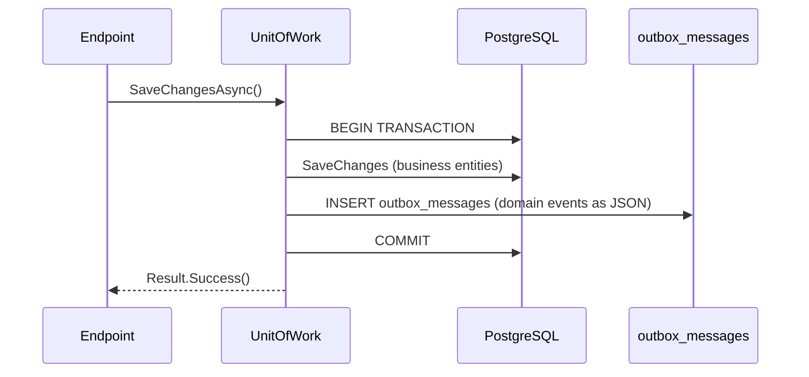
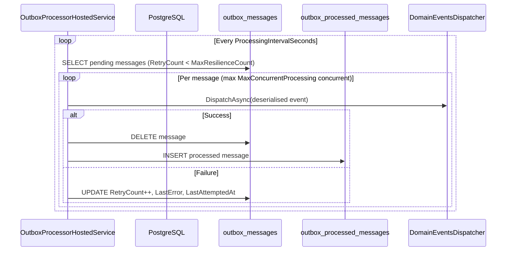
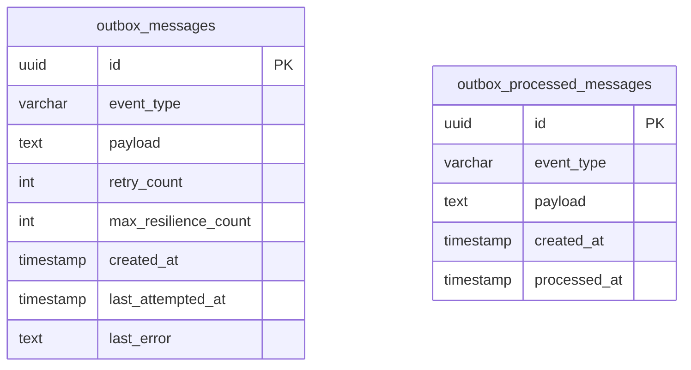

# Outbox Pattern

| Field | Value |
|-------|-------|
| **Date** | 2026-03-03 |
| **Author** | Copilot (antigravity) |
| **Significance** | 🔴 Major |
| **Status** | ✅ Approved |

---

## Summary

Introduce the **Transactional Outbox Pattern** to the backend, replacing the current synchronous in-transaction domain event dispatch (`DomainEventsDispatcher`) with a reliable, resilient, eventually-consistent event processing pipeline.

---

## Motivation

The current `UnitOfWork.SaveChangesAsync()` dispatches domain events **synchronously within the same database transaction**. This creates coupling between the primary write and side-effect handlers, and has the following risks:

1. **No resilience** — if a handler throws, the entire transaction rolls back, including the business data write.
2. **No retry mechanism** — transient failures (e.g. network blip to a downstream service) permanently lose the event.
3. **No observability** — there is no audit trail of which events were dispatched and when.
4. **Performance bottleneck** — long-running handlers (e.g. email, external API calls) block the HTTP request.

The Outbox Pattern decouples event storage from event processing while preserving atomicity: events are saved in the same DB transaction as the business data, and a background job picks them up for processing.

---

## Design Decision

### Two Tables

| Table | Purpose |
|-------|---------|
| `outbox_messages` | Stores pending events (JSON payload) to be processed |
| `outbox_processed_messages` | Audit log of successfully processed events |

### OutboxMessage fields

| Field | Type | Notes |
|-------|------|-------|
| `Id` | `Guid` | Primary key |
| `EventType` | `string` | Fully-qualified CLR type name |
| `Payload` | `string` | JSON-serialized event |
| `RetryCount` | `int` | How many times this has been attempted |
| `MaxResilienceCount` | `int` | Copied from config at creation time |
| `CreatedAt` | `DateTime` | UTC |
| `LastAttemptedAt` | `DateTime?` | UTC, nullable |
| `LastError` | `string?` | Last exception message |

### OutboxProcessedMessage fields

| Field | Type | Notes |
|-------|------|-------|
| `Id` | `Guid` | Same `Id` as the source `OutboxMessage` |
| `EventType` | `string` | Fully-qualified CLR type name |
| `Payload` | `string` | JSON-serialized event |
| `CreatedAt` | `DateTime` | UTC (when original message was created) |
| `ProcessedAt` | `DateTime` | UTC (when successfully processed) |

### IOutboxService

```csharp
Task StoreManyAsync(IEnumerable<IDomainEvent> domainEvents, CancellationToken ct);
```

Serializes each event to JSON (including the concrete type name) and persists it to `outbox_messages` in the caller's ambient transaction.

### UnitOfWork — unchanged

`UnitOfWork.SaveChangesAsync()` retains its original synchronous domain event dispatch via `DomainEventsDispatcher`. The outbox pattern is **additive and opt-in** — callers that require resilient, async processing can inject `IOutboxService` directly and call `StoreManyAsync()` independently. This preserves existing synchronous behaviour while providing the outbox infrastructure for use where needed.

### OutboxProcessorHostedService (Background Job)

- Implements `BackgroundService`
- Runs every `Outbox:ProcessingIntervalSeconds` (default 60 s)
- Queries `outbox_messages` ordered by `CreatedAt ASC`
- Uses `SELECT FOR UPDATE SKIP LOCKED` semantics via row-level processing to prevent duplicate dispatch across multiple instances
- Controls concurrency via `SemaphoreSlim(MaxConcurrentProcessing)` — default **4** (tuned for 4-core/2 GB server)
- For each message:
  1. Deserialises the payload back to the concrete `IDomainEvent` type
  2. Dispatches via `DomainEventsDispatcher`
  3. On success: deletes from `outbox_messages`, inserts into `outbox_processed_messages`
  4. On failure: increments `RetryCount`; if `RetryCount >= MaxResilienceCount`, leaves in table (requires manual intervention or a dead-letter mechanism)

### Configuration (appsettings.json)

```json
"Outbox": {
  "MaxResilienceCount": 5,
  "ProcessingIntervalSeconds": 60,
  "MaxConcurrentProcessing": 4
}
```

---

## Diagrams

### Sequence Diagram — Write Path (HTTP Request)



### Sequence Diagram — Process Path (Background Job)



### ER Diagram



---

## Files Affected

| Action | Path |
|--------|------|
| NEW | `Backend/Features/OutboxModule/Domain/OutboxMessage.cs` |
| NEW | `Backend/Features/OutboxModule/Domain/OutboxProcessedMessage.cs` |
| NEW | `Backend/Features/OutboxModule/Domain/OutboxMessageEntityConfiguration.cs` |
| NEW | `Backend/Features/OutboxModule/Domain/OutboxProcessedMessageEntityConfiguration.cs` |
| NEW | `Backend/Features/OutboxModule/OutboxSettings.cs` |
| NEW | `Backend/Features/OutboxModule/IOutboxService.cs` |
| NEW | `Backend/Features/OutboxModule/OutboxService.cs` |
| NEW | `Backend/Features/OutboxModule/OutboxProcessorHostedService.cs` |
| MODIFIED | `Backend/Data/ApplicationDbContext.cs` |
| MODIFIED | `Backend/Program.cs` |
| MODIFIED | `Backend/appsettings.json` |
| NEW | `Backend/Migrations/<timestamp>_AddOutboxTables.cs` |

---

## Risks & Mitigations

| Risk | Mitigation |
|------|-----------|
| Events processed more than once (at-least-once delivery) | All existing handlers use idempotent DB operations (unique index on streak log, snapshot guards). No additional idempotency needed for current handlers. |
| Background job crashes mid-processing | `RetryCount` is only incremented on failure; successful messages are deleted atomically. On restart, unprocessed messages are retried. |
| Outbox table grows unboundedly | Processed messages are moved to `outbox_processed_messages`. Failed messages stay in `outbox_messages` until `RetryCount >= MaxResilienceCount` — manual monitoring required. |
| Multiple application instances double-processing | Each message is processed in its own transaction; `RetryCount` update acts as an optimistic guard. For production multi-instance deployments, advisory locks or `SKIP LOCKED` can be added. |
| Performance degradation | Background job uses `SemaphoreSlim` to limit concurrency to `MaxConcurrentProcessing` (default 4), appropriate for a 4-core server. |
