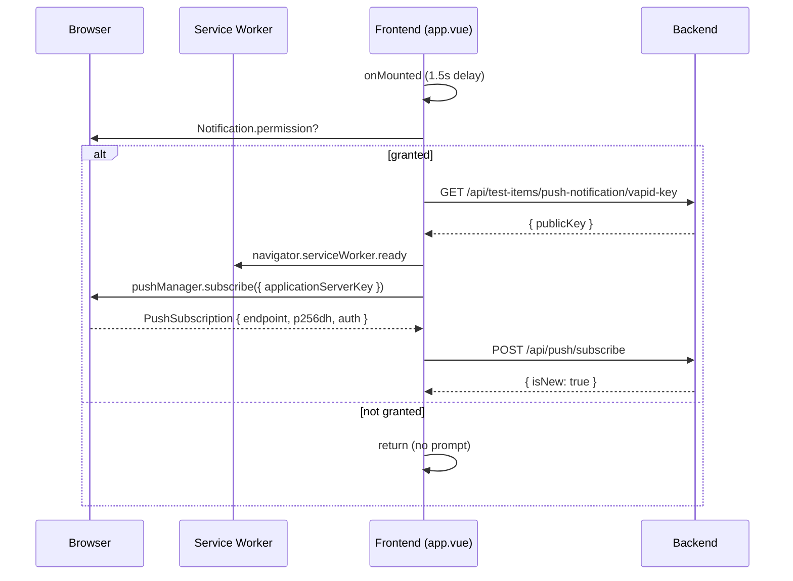
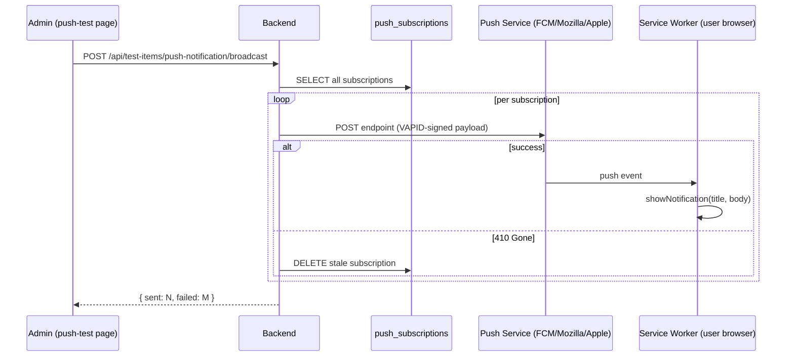
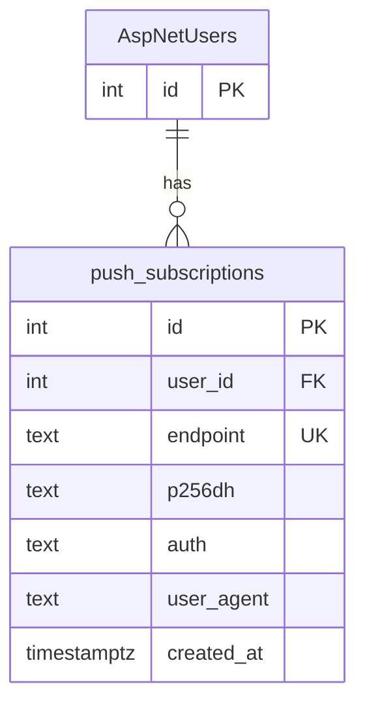

# Web Push Notification Broadcast

| Field | Value |
|-------|-------|
| **Date** | 2026-03-13 |
| **Author** | Copilot (antigravity) |
| **Significance** | 🔴 Major |
| **Status** | ✅ Approved |

---

## Summary

Implement a **Web Push Notification system** using the VAPID protocol (no FCM, no third-party push vendor). The system stores browser push subscriptions in the database and supports both single-user targeting and admin-initiated broadcast to all subscribers. A PWA service worker handles notification display on the client.

---

## Motivation

1. **Re-engagement** — users who installed the PWA have no mechanism to be notified of new assignments, daily reads, or announcements unless they are actively in the app.
2. **No vendor lock-in** — VAPID (Voluntary Application Server Identification) is a W3C standard supported natively by all major browsers (Chrome, Firefox, Safari 16.4+). No FCM account or server-side API key is required.
3. **No recurring cost** — VAPID push is free. The push service is operated by each browser vendor (Google, Mozilla, Apple) and the app communicates with it directly.
4. **Foundation for domain notifications** — this implementation establishes the `IPushNotificationService` interface and `push_subscriptions` table, which future domain events (assignment created, streak milestone, etc.) can reuse via `SendToUserAsync`.

---

## Design Decision

### Key technology choices

| Choice | Decision | Rationale |
|--------|----------|-----------|
| Push protocol | VAPID (raw Web Push) | Free, no FCM required, W3C standard |
| Backend library | `WebPush` NuGet 1.0.12 | Thin wrapper for VAPID signing; no external runtime dependencies |
| Key storage | `appsettings.json` (local) / env var (production) | VAPID key pair is long-lived; generated once via `generate-vapid.ps1` |
| Subscription storage | `push_subscriptions` PostgreSQL table | Unique per browser endpoint; supports per-user and broadcast queries |
| SW handler | `sw-custom.js` `push` event | Already present in the project; displays notification via `showNotification` |

### VAPID Key Management

VAPID keys are generated once and reused. A helper script is provided:

```powershell
# Backend/generate-vapid.ps1
.\generate-vapid.ps1
# Outputs PublicKey + PrivateKey → paste into appsettings.json Vapid section
```

Keys must be kept stable — rotating them invalidates **all existing browser subscriptions** and requires all users to re-subscribe.

### `push_subscriptions` table

| Column | Type | Notes |
|--------|------|-------|
| `id` | `int` PK | Auto-increment |
| `user_id` | `int` FK → `AspNetUsers` | Cascade delete on user removal |
| `endpoint` | `text` UNIQUE | Push service URL assigned by the browser vendor |
| `p256dh` | `text` | ECDH public key (base64url) |
| `auth` | `text` | Auth secret (base64url) |
| `user_agent` | `text?` | Optional — for debugging which browser/device |
| `created_at` | `timestamptz` | Default `now()` |

Unique constraint on `endpoint` (not `user_id + endpoint`) because one browser endpoint can only belong to one user. Upsert logic updates keys if the endpoint already exists.

### IPushNotificationService

```csharp
Task SendAsync(string endpoint, string p256dh, string auth, PushPayload payload, CancellationToken ct);
Task<(int Sent, int Failed)> BroadcastAsync(PushPayload payload, CancellationToken ct);
Task SendToUserAsync(int userId, PushPayload payload, CancellationToken ct);
```

`BroadcastAsync` automatically cleans up stale subscriptions that return HTTP 410 Gone (browser unsubscribed or expired).

### Auto-subscribe on app mount

The frontend composable `usePushNotification` is called from `app.vue` with a 1.5 s delay (to allow the auth session/JWT to hydrate). It:
1. Checks `Notification.permission === 'granted'` — if not granted, does nothing (no prompt)
2. Fetches VAPID public key from backend
3. Gets or creates the browser `PushSubscription`
4. POSTs to `POST /api/push/subscribe` (idempotent upsert)

This means every page load silently re-registers the subscription, keeping keys fresh without any user interaction after the first grant.

### API Surface

| Method | Route | Auth | Purpose |
|--------|-------|------|---------|
| `POST` | `/api/push/subscribe` | Any authenticated user | Save/update browser subscription in DB |
| `DELETE` | `/api/push/unsubscribe` | Any authenticated user | Remove subscription from DB + browser |
| `GET` | `/api/push/subscriber-count` | Admin | Count of active subscriptions |
| `GET` | `/api/test-items/push-notification/vapid-key` | Anonymous | Return VAPID public key to frontend |
| `POST` | `/api/test-items/push-notification` | Admin | Send push to a single supplied subscription |
| `POST` | `/api/test-items/push-notification/broadcast` | Admin | Broadcast to all stored subscriptions |

---

## Diagrams

### Sequence — First-time subscribe flow



### Sequence — Broadcast push flow



### ER Diagram



---

## Files Affected

| Action | Path |
|--------|------|
| NEW | `Backend/Features/PushNotificationModule/Domain/PushSubscription.cs` |
| NEW | `Backend/Features/PushNotificationModule/PushSubscriptionEntityConfiguration.cs` |
| NEW | `Backend/Features/PushNotificationModule/IPushNotificationService.cs` |
| NEW | `Backend/Features/PushNotificationModule/PushNotificationService.cs` |
| NEW | `Backend/Features/PushNotificationModule/PushNotificationEndpointGroup.cs` |
| NEW | `Backend/Features/PushNotificationModule/Endpoints/SubscribePushEndpoint.cs` |
| NEW | `Backend/Features/PushNotificationModule/Endpoints/UnsubscribePushEndpoint.cs` |
| NEW | `Backend/Features/PushNotificationModule/Endpoints/GetSubscriberCountEndpoint.cs` |
| NEW | `Backend/Features/TestModule/VapidSettings.cs` |
| NEW | `Backend/Features/TestModule/Endpoints/GetVapidPublicKeyEndpoint.cs` |
| NEW | `Backend/Features/TestModule/Endpoints/SendTestPushNotificationEndpoint.cs` |
| NEW | `Backend/Features/TestModule/Endpoints/BroadcastPushNotificationEndpoint.cs` |
| NEW | `Backend/generate-vapid.ps1` |
| NEW | `Backend/Migrations/20260313052436_AddPushSubscriptions.cs` |
| MODIFIED | `Backend/Data/ApplicationDbContext.cs` |
| MODIFIED | `Backend/Program.cs` |
| MODIFIED | `Backend/appsettings.json` |
| MODIFIED | `Backend/PureTCOWebApp.csproj` |
| NEW | `Frontend/app/composables/push-notification.ts` |
| NEW | `Frontend/app/pages/admin/push-test.vue` |
| MODIFIED | `Frontend/app/app.vue` |
| MODIFIED | `Frontend/app/layouts/admin.vue` |
| MODIFIED | `Frontend/nuxt.config.ts` |

---

## Risks & Mitigations

| Risk | Mitigation |
|------|-----------|
| VAPID key rotation invalidates all subscriptions | Keys are long-lived by design; `generate-vapid.ps1` is for initial setup or explicit rotation. Document this in README. |
| Browser silently drops expired subscriptions | `BroadcastAsync` detects HTTP 410 Gone and auto-deletes stale rows from `push_subscriptions`. |
| Auto-subscribe fires before JWT is ready | 1.5 s `setTimeout` in `app.vue` gives auth hydration time; `$authedFetch` also retries after token refresh before giving up. |
| `Notification.permission` is `denied` | `autoSubscribe()` returns early without prompting; user must manually allow via browser settings. No UX disruption. |
| Safari push support | Supported from Safari 16.4+ (March 2023) on both macOS and iOS 16.4+. Older Safari silently skips subscription. |
| Multi-instance backend duplicate broadcasts | Broadcast is admin-triggered and idempotent per endpoint — worst case is the same user gets two notifications. Acceptable for current scale; lock can be added later. |
